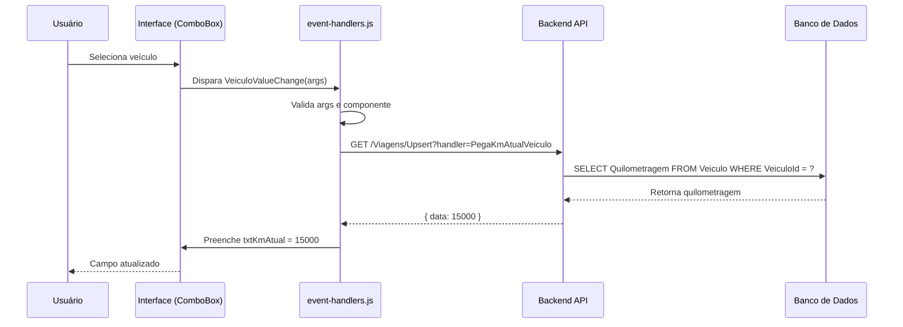
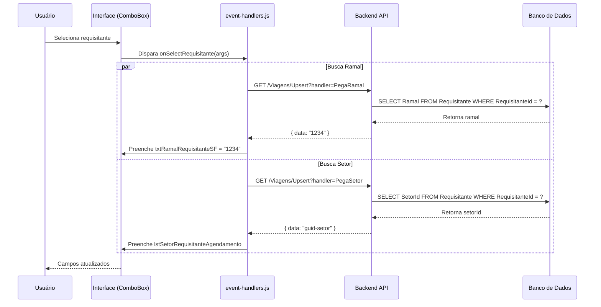

# Documentação: event-handlers.js - Gerenciadores de Eventos da Agenda

> **Última Atualização**: 18/01/2026
> **Versão Atual**: 1.3

---

# PARTE 1: DOCUMENTAÇÃO DA FUNCIONALIDADE

## Índice
1. [Visão Geral](#visão-geral)
2. [Arquitetura](#arquitetura)
3. [Estrutura de Arquivos](#estrutura-de-arquivos)
4. [Lógica de Negócio](#lógica-de-negócio)
5. [Interconexões](#interconexões)
6. [Funções Principais](#funções-principais)
7. [Fluxos de Dados](#fluxos-de-dados)
8. [Validações](#validações)
9. [Exemplos de Uso](#exemplos-de-uso)
10. [Troubleshooting](#troubleshooting)

---

## Visão Geral

**Descrição**: O arquivo `event-handlers.js` é o **coração do sistema de eventos da Agenda de Viagens**. Ele centraliza todos os manipuladores (handlers) de eventos disparados pelos componentes da interface, como seleção de veículos, motoristas, requisitantes, finalidades e datas.

### Características Principais
- ✅ **Centralização de Eventos**: Todos os handlers de mudança de valores dos componentes Syncfusion
- ✅ **Integração com API**: Realiza chamadas AJAX para buscar dados complementares (KM do veículo, ramal do requisitante, setor, etc.)
- ✅ **Validação em Tempo Real**: Valida e atualiza campos automaticamente conforme o usuário interage
- ✅ **Gestão de Estado**: Atualiza o estado da aplicação baseado nas interações do usuário
- ✅ **Tratamento de Erros**: Sistema robusto de tratamento de erros com alertas personalizados

### Objetivo
Este arquivo garante que todas as interações do usuário com os componentes da tela de Agenda sejam processadas corretamente, buscando dados complementares do servidor quando necessário e mantendo a interface sincronizada com o backend.

**Por que existe?**
Sem este arquivo, os componentes Syncfusion (ComboBox, DropDownTree, DatePicker, etc.) não teriam comportamento inteligente - eles seriam apenas campos simples sem auto-preenchimento, sem validação e sem integração com o banco de dados.

---

## Arquitetura

### Tecnologias Utilizadas
| Tecnologia | Versão | Uso |
|------------|--------|-----|
| jQuery | 3.6.0+ | Manipulação DOM e chamadas AJAX |
| Syncfusion EJ2 | Latest | Componentes de UI (ComboBox, DropDownTree, DatePicker) |
| JavaScript ES6 | - | Sintaxe moderna (const, arrow functions, template strings) |

### Padrões de Design
- **Event-Driven Architecture**: Baseado em eventos disparados pelos componentes Syncfusion
- **Dependency Injection**: As funções dependem de objetos globais (window.criarErroAjax, Alerta)
- **Separation of Concerns**: Cada função trata de um tipo específico de evento
- **Error Handling Pattern**: Try-catch em todas as funções com logging centralizado

### Dependências
Este arquivo depende de:
- `alerta.js` - Sistema de alertas customizado (SweetAlert wrapper)
- `ajax-helper.js` - Função `window.criarErroAjax` para padronização de erros
- Syncfusion EJ2 Components - Todos os componentes da UI
- jQuery - Para chamadas AJAX e manipulação DOM

---

## Estrutura de Arquivos

### Arquivo Principal
```
wwwroot/js/agendamento/components/event-handlers.js
```

### Arquivos Relacionados
- `controls-init.js` - Inicializa os componentes e vincula os event handlers
- `modal-config.js` - Configurações do modal de agendamento
- `validacao.js` - Validações de formulário
- `exibe-viagem.js` - Exibição de dados de viagens existentes
- **Backend**:
  - `Pages/Viagens/Upsert.cshtml.cs` - Handlers do servidor (OnGetPegaKmAtualVeiculo, OnGetPegaRamal, OnGetPegaSetor, etc.)

---

## Lógica de Negócio

### Fluxo Geral de um Event Handler

```
1. Usuário interage com componente (ex: seleciona um veículo)
   ↓
2. Syncfusion dispara evento 'change' ou 'select'
   ↓
3. Event handler (ex: VeiculoValueChange) é chamado
   ↓
4. Handler valida os dados recebidos
   ↓
5. Handler faz chamada AJAX para o servidor (se necessário)
   ↓
6. Servidor retorna dados complementares (ex: KM do veículo)
   ↓
7. Handler preenche outros campos automaticamente
   ↓
8. Interface é atualizada visualmente
```

---

## Funções Principais

### 1. `onSelectRequisitante(args)`

**Localização**: Linha 20 do arquivo `event-handlers.js`

**Propósito**: Executado quando o usuário **seleciona um requisitante da lista**. Preenche automaticamente o campo de **Ramal** e **Setor** do requisitante selecionado.

**Parâmetros**:
- `args` (object): Objeto com dados do evento disparado pelo Syncfusion
  - `args.itemData`: Dados do item selecionado
  - `args.itemData.RequisitanteId`: GUID do requisitante

**Retorno**: void

**Código**:
```javascript
window.onSelectRequisitante = function (args)
{
    try
    {
        console.log("🔔 onSelectRequisitante disparado");
        console.log("   Args completo:", args);

        if (!args || !args.itemData)
        {
            console.warn("   ⚠️ args ou itemData ausente");
            return;
        }

        const requisitanteId = args.itemData.RequisitanteId;
        console.log("   RequisitanteId selecionado:", requisitanteId);

        if (!requisitanteId)
        {
            console.warn("   ⚠️ RequisitanteId vazio");
            return;
        }

        // ===== BUSCA RAMAL =====
        $.ajax({
            url: "/Viagens/Upsert?handler=PegaRamal",
            method: "GET",
            dataType: "json",
            data: { id: requisitanteId },
            success: function (res)
            {
                console.log("   ✅ Ramal recebido:", res.data);
                const ramalInput = $("#txtRamalRequisitanteSF");
                if (ramalInput.length)
                {
                    ramalInput.val(res.data || "");
                    console.log("   ✅ Ramal preenchido:", res.data);
                }
            },
            error: function (jqXHR, textStatus, errorThrown)
            {
                console.error("   ❌ Erro ao buscar ramal:", textStatus);
                const erro = window.criarErroAjax(jqXHR, textStatus, errorThrown, this);
                Alerta.TratamentoErroComLinha("event-handlers.js", "onSelectRequisitante - PegaRamal", erro);
            }
        });

        // ===== BUSCA SETOR =====
        $.ajax({
            url: "/Viagens/Upsert?handler=PegaSetor",
            method: "GET",
            dataType: "json",
            data: { id: requisitanteId },
            success: function (res)
            {
                console.log("   ✅ Setor recebido:", res.data);
                const setorReqAgendamento = document.getElementById("lstSetorRequisitanteAgendamento");

                if (setorReqAgendamento?.ej2_instances?.[0])
                {
                    setorReqAgendamento.ej2_instances[0].value = [res.data];
                    console.log("   ✅ Setor preenchido:", res.data);
                }
            },
            error: function (jqXHR, textStatus, errorThrown)
            {
                console.error("   ❌ Erro ao buscar setor:", textStatus);
                const erro = window.criarErroAjax(jqXHR, textStatus, errorThrown, this);
                Alerta.TratamentoErroComLinha("event-handlers.js", "onSelectRequisitante - PegaSetor", erro);
            }
        });
    } catch (error)
    {
        console.error("❌ Erro em onSelectRequisitante:", error);
        Alerta.TratamentoErroComLinha("event-handlers.js", "onSelectRequisitante", error);
    }
};
```

**Fluxo de Execução**:
1. Valida se `args` e `args.itemData` existem
2. Extrai o `RequisitanteId` do item selecionado
3. Faz **duas chamadas AJAX paralelas**:
   - `/Viagens/Upsert?handler=PegaRamal` → Busca o ramal do requisitante
   - `/Viagens/Upsert?handler=PegaSetor` → Busca o setor padrão do requisitante
4. Preenche os campos `txtRamalRequisitanteSF` e `lstSetorRequisitanteAgendamento`
5. Loga todas as etapas no console para facilitar debug

**Casos Especiais**:
- **Requisitante sem ramal cadastrado**: Campo fica vazio
- **Requisitante sem setor cadastrado**: Campo fica vazio
- **Erro na API**: Exibe alerta de erro usando `Alerta.TratamentoErroComLinha`

---

### 2. `VeiculoValueChange(args)`

**Localização**: Linha 411 do arquivo `event-handlers.js`

**Propósito**: Executado quando o usuário **seleciona um veículo**. Busca a **quilometragem atual** do veículo no banco de dados e preenche o campo `txtKmAtual`.

**Parâmetros**:
- `args` (object): Objeto com dados do evento disparado pelo Syncfusion ComboBox

**Retorno**: void

**Código**:
```javascript
window.VeiculoValueChange = function (args)
{
    try
    {
        console.log("🚗 VeiculoValueChange chamado");
        console.log("   Args recebido:", args);

        const lstVeiculo = document.getElementById("lstVeiculo");
        if (!lstVeiculo || !lstVeiculo.ej2_instances || !lstVeiculo.ej2_instances[0])
        {
            console.warn("⚠️ lstVeiculo não encontrado ou não inicializado");
            return;
        }

        const veiculoObj = lstVeiculo.ej2_instances[0];
        console.log("   Objeto Veículo:", veiculoObj);
        console.log("   Valor selecionado:", veiculoObj.value);

        if (!veiculoObj.value || veiculoObj.enabled === false)
        {
            console.log("   Nenhum veículo selecionado ou campo desabilitado");
            return;
        }

        const veiculoid = String(veiculoObj.value);
        console.log("   VeiculoId para buscar KM:", veiculoid);

        // Pega Km Atual do Veículo
        $.ajax({
            url: "/Viagens/Upsert?handler=PegaKmAtualVeiculo",
            method: "GET",
            dataType: "json",
            data: { id: veiculoid },
            success: function (res)
            {
                console.log("✅ Resposta do servidor:", res);
                const km = res.data || 0;
                const kmAtual = document.getElementById("txtKmAtual");

                if (kmAtual)
                {
                    kmAtual.value = km;
                    console.log("✅ Km Atual preenchido com:", km);
                }
                else
                {
                    console.error("❌ Campo txtKmAtual não encontrado");
                }
            },
            error: function (jqXHR, textStatus, errorThrown)
            {
                console.error("❌ Erro ao buscar KM do veículo:", {
                    status: jqXHR.status,
                    statusText: jqXHR.statusText,
                    textStatus: textStatus,
                    errorThrown: errorThrown,
                    response: jqXHR.responseText
                });
                const erro = window.criarErroAjax(jqXHR, textStatus, errorThrown, this);
                Alerta.TratamentoErroComLinha("event-handlers.js", "VeiculoValueChange", erro);
            }
        });
    } catch (error)
    {
        console.error("❌ Erro em VeiculoValueChange:", error);
        Alerta.TratamentoErroComLinha("event-handlers.js", "VeiculoValueChange", error);
    }
};
```

**Fluxo de Execução**:
1. Valida se o componente `lstVeiculo` está inicializado
2. Verifica se há um valor selecionado e se o campo está habilitado
3. Extrai o `VeiculoId` do ComboBox
4. Faz chamada AJAX para `/Viagens/Upsert?handler=PegaKmAtualVeiculo`
5. Servidor retorna a quilometragem atual do veículo (campo `Quilometragem` da tabela `Veiculo`)
6. Preenche o campo `txtKmAtual` com o valor recebido

**Casos Especiais**:
- **Veículo sem quilometragem cadastrada**: Preenche com 0
- **Campo desabilitado**: Não executa a busca
- **Erro na API**: Exibe alerta de erro e loga no console

**Importância**:
Esta função é **crítica** para o fluxo de criação de viagens, pois a quilometragem inicial deve corresponder à quilometragem atual do veículo no momento da criação da viagem.

---

### 3. `lstFinalidade_Change(args)`

**Localização**: Linha 305 do arquivo `event-handlers.js`

**Propósito**: Executado quando o usuário **altera a finalidade** da viagem. Se a finalidade selecionada for **"Evento"**, exibe a seção de seleção/cadastro de eventos.

**Parâmetros**:
- `args` (object): Objeto com dados do evento

**Retorno**: void

**Código**:
```javascript
window.lstFinalidade_Change = function (args)
{
    try
    {
        console.log("🎯 lstFinalidade_Change chamado");

        if (!args || !args.itemData)
        {
            console.warn("   ⚠️ args ou itemData ausente");
            return;
        }

        const finalidadeTexto = args.itemData.Descricao;
        console.log("   Finalidade selecionada:", finalidadeTexto);

        const sectionEvento = document.getElementById("sectionEvento");
        const divFinalidadeOrigemDestino = document.getElementById("divFinalidadeOrigemDestino");

        if (finalidadeTexto && finalidadeTexto.toLowerCase().includes("evento"))
        {
            console.log("   ✅ Finalidade é EVENTO - exibindo seção de evento");
            if (sectionEvento) sectionEvento.style.display = "block";
            if (divFinalidadeOrigemDestino) divFinalidadeOrigemDestino.style.display = "none";
        }
        else
        {
            console.log("   ℹ️ Finalidade NÃO é evento - ocultando seção de evento");
            if (sectionEvento) sectionEvento.style.display = "none";
            if (divFinalidadeOrigemDestino) divFinalidadeOrigemDestino.style.display = "block";
        }
    } catch (error)
    {
        console.error("❌ Erro em lstFinalidade_Change:", error);
        Alerta.TratamentoErroComLinha("event-handlers.js", "lstFinalidade_Change", error);
    }
};
```

**Fluxo de Execução**:
1. Valida se `args` e `args.itemData` existem
2. Extrai a descrição da finalidade selecionada
3. Verifica se a descrição contém a palavra "evento" (case-insensitive)
4. Se for evento:
   - Exibe `sectionEvento` (seção de seleção/cadastro de eventos)
   - Oculta `divFinalidadeOrigemDestino` (campos de origem e destino)
5. Se **não** for evento:
   - Oculta `sectionEvento`
   - Exibe `divFinalidadeOrigemDestino`

**Casos Especiais**:
- **Finalidade "Evento Esportivo"**: Exibe seção de evento
- **Finalidade "Evento Cultural"**: Exibe seção de evento
- **Qualquer finalidade sem "evento" no nome**: Exibe origem/destino normalmente

---

### 4. `MotoristaValueChange()`

**Localização**: Linha 386 do arquivo `event-handlers.js`

**Propósito**: Placeholder para lógica futura quando motorista for alterado. Atualmente apenas loga no console.

**Código**:
```javascript
window.MotoristaValueChange = function ()
{
    try
    {
        console.log("👨‍✈️ MotoristaValueChange chamado");
        // Lógica futura: buscar foto, dados do motorista, etc.
    } catch (error)
    {
        Alerta.TratamentoErroComLinha("event-handlers.js", "MotoristaValueChange", error);
    }
};
```

**Possíveis expansões futuras**:
- Buscar foto do motorista e exibir
- Verificar se motorista está disponível na data selecionada
- Carregar histórico de viagens do motorista

---

### 5. `onDateChange(args)`

**Localização**: Linha 521 do arquivo `event-handlers.js`

**Propósito**: Executado quando o usuário **altera a data inicial** da viagem. Atualiza o estado da aplicação.

**Código**:
```javascript
window.onDateChange = function (args)
{
    try
    {
        console.log("📅 onDateChange chamado");
        console.log("   Args:", args);

        if (!args || !args.value)
        {
            console.warn("   ⚠️ Data vazia");
            return;
        }

        console.log("   Data selecionada:", args.value);
        // Lógica futura: validar disponibilidade de veículo/motorista nesta data
    } catch (error)
    {
        console.error("❌ Erro em onDateChange:", error);
        Alerta.TratamentoErroComLinha("event-handlers.js", "onDateChange", error);
    }
};
```

---

### 6. Funções de Gestão de Eventos

#### `inicializarEventoSelect()`

**Localização**: Linha 552

**Propósito**: Configura o evento `select` do ComboBox de eventos. Quando um evento é selecionado da lista, carrega e exibe seus dados automaticamente.

**Código**:
```javascript
function inicializarEventoSelect()
{
    try
    {
        const lstEventos = document.getElementById("lstEventos");
        if (!lstEventos?.ej2_instances?.[0])
        {
            console.warn("⚠️ lstEventos não encontrado");
            return;
        }

        const eventosCombo = lstEventos.ej2_instances[0];

        eventosCombo.select = null;
        eventosCombo.select = function (args)
        {
            try
            {
                console.log("🎪 Evento selecionado:", args);

                if (!args?.itemData?.EventoId)
                {
                    console.warn("   ⚠️ EventoId não encontrado");
                    return;
                }

                const eventoId = args.itemData.EventoId;
                console.log("   Buscando dados do evento:", eventoId);

                // Busca dados completos do evento
                $.ajax({
                    url: "/api/Viagem/ObterEvento",
                    method: "GET",
                    dataType: "json",
                    data: { id: eventoId },
                    success: function (response)
                    {
                        console.log("   ✅ Dados do evento recebidos:", response);
                        exibirDadosEvento(response);
                    },
                    error: function (jqXHR, textStatus, errorThrown)
                    {
                        console.error("   ❌ Erro ao buscar evento:", textStatus);
                        const erro = window.criarErroAjax(jqXHR, textStatus, errorThrown, this);
                        Alerta.TratamentoErroComLinha("event-handlers.js", "lstEventos.select", erro);
                    }
                });
            } catch (innerError)
            {
                console.error("❌ Erro no select de evento:", innerError);
                Alerta.TratamentoErroComLinha("event-handlers.js", "lstEventos.select - inner", innerError);
            }
        };

        console.log("✅ Evento 'select' do lstEventos configurado");
    } catch (error)
    {
        console.error("❌ Erro ao inicializar evento select:", error);
        Alerta.TratamentoErroComLinha("event-handlers.js", "inicializarEventoSelect", error);
    }
}
```

---

#### `exibirDadosEvento(eventoData)`

**Localização**: Linha 602

**Propósito**: Exibe os dados de um evento selecionado nos campos do formulário (somente leitura).

**Parâmetros**:
- `eventoData` (object): Dados completos do evento

**Código**:
```javascript
function exibirDadosEvento(eventoData)
{
    try
    {
        console.log("🎪 Exibindo dados do evento:", eventoData);

        if (!eventoData)
        {
            console.warn("   ⚠️ eventoData vazio");
            return;
        }

        // Exibir div de dados do evento
        const divDadosEvento = document.getElementById("divDadosEventoSelecionado");
        if (divDadosEvento)
        {
            divDadosEvento.style.display = "flex";
            console.log("   ✅ Div de dados exibida");
        }

        // Preencher campos
        preencherCamposEvento(eventoData);

    } catch (error)
    {
        console.error("❌ Erro ao exibir dados do evento:", error);
        Alerta.TratamentoErroComLinha("event-handlers.js", "exibirDadosEvento", error);
    }
}
```

---

#### `preencherCamposEvento(dados)`

**Localização**: Linha 663

**Propósito**: Preenche os campos de data início, data fim e quantidade de participantes do evento selecionado.

**Código**:
```javascript
function preencherCamposEvento(dados)
{
    try
    {
        console.log("📝 Preenchendo campos do evento:", dados);

        // Data Início
        const txtDataInicioEvento = document.getElementById("txtDataInicioEvento");
        if (txtDataInicioEvento?.ej2_instances?.[0] && dados.dataInicio)
        {
            const dataInicio = new Date(dados.dataInicio);
            txtDataInicioEvento.ej2_instances[0].value = dataInicio;
            console.log("   ✅ Data início preenchida:", dataInicio);
        }

        // Data Fim
        const txtDataFimEvento = document.getElementById("txtDataFimEvento");
        if (txtDataFimEvento?.ej2_instances?.[0] && dados.dataFim)
        {
            const dataFim = new Date(dados.dataFim);
            txtDataFimEvento.ej2_instances[0].value = dataFim;
            console.log("   ✅ Data fim preenchida:", dataFim);
        }

        // Quantidade de Participantes
        const txtQtdParticipantesEvento = document.getElementById("txtQtdParticipantesEvento");
        if (txtQtdParticipantesEvento?.ej2_instances?.[0])
        {
            txtQtdParticipantesEvento.ej2_instances[0].value = dados.qtdParticipantes || 0;
            console.log("   ✅ Qtd participantes preenchida:", dados.qtdParticipantes);
        }

        console.log("✅ Todos os campos do evento preenchidos");
    } catch (error)
    {
        console.error("❌ Erro ao preencher campos do evento:", error);
        Alerta.TratamentoErroComLinha("event-handlers.js", "preencherCamposEvento", error);
    }
}
```

---

#### `ocultarDadosEvento()`

**Localização**: Linha 731

**Propósito**: Oculta a seção de dados do evento e limpa os campos.

**Código**:
```javascript
function ocultarDadosEvento()
{
    try
    {
        console.log("🔒 Ocultando dados do evento");

        const divDadosEvento = document.getElementById("divDadosEventoSelecionado");
        if (divDadosEvento)
        {
            divDadosEvento.style.display = "none";
            console.log("   ✅ Div de dados ocultada");
        }

        // Limpar campos
        const txtDataInicioEvento = document.getElementById("txtDataInicioEvento");
        if (txtDataInicioEvento?.ej2_instances?.[0])
        {
            txtDataInicioEvento.ej2_instances[0].value = null;
        }

        const txtDataFimEvento = document.getElementById("txtDataFimEvento");
        if (txtDataFimEvento?.ej2_instances?.[0])
        {
            txtDataFimEvento.ej2_instances[0].value = null;
        }

        const txtQtdParticipantesEvento = document.getElementById("txtQtdParticipantesEvento");
        if (txtQtdParticipantesEvento?.ej2_instances?.[0])
        {
            txtQtdParticipantesEvento.ej2_instances[0].value = 0;
        }

        console.log("✅ Dados do evento limpos");
    } catch (error)
    {
        console.error("❌ Erro ao ocultar dados do evento:", error);
        Alerta.TratamentoErroComLinha("event-handlers.js", "ocultarDadosEvento", error);
    }
}
```

---

## Interconexões

### Quem Chama Este Arquivo

1. **`controls-init.js`** (linha ~100-140)
   - Vincula os event handlers aos componentes Syncfusion durante a inicialização
   - Exemplo:
     ```javascript
     veiculoObj.change = function (args) {
         if (window.VeiculoValueChange) {
             window.VeiculoValueChange(args);
         }
     };
     ```

2. **Componentes Syncfusion** (via eventos nativos)
   - Quando usuário seleciona item em ComboBox, DropDownTree, etc.
   - Syncfusion dispara evento `change` ou `select`
   - Event handler correspondente é executado

### O Que Este Arquivo Chama

1. **Backend (via AJAX)**:
   - `/Viagens/Upsert?handler=PegaKmAtualVeiculo` → Busca quilometragem do veículo
   - `/Viagens/Upsert?handler=PegaRamal` → Busca ramal do requisitante
   - `/Viagens/Upsert?handler=PegaSetor` → Busca setor do requisitante
   - `/api/Viagem/ObterEvento` → Busca dados completos de um evento

2. **`alerta.js`**:
   - `Alerta.TratamentoErroComLinha()` → Exibe erros ao usuário

3. **`ajax-helper.js`**:
   - `window.criarErroAjax()` → Padroniza objetos de erro AJAX

### Fluxo de Dados Completo

```
Usuário seleciona veículo no ComboBox
    ↓
Syncfusion dispara evento 'change'
    ↓
controls-init.js chama window.VeiculoValueChange(args)
    ↓
event-handlers.js processa evento
    ↓
Faz AJAX para /Viagens/Upsert?handler=PegaKmAtualVeiculo
    ↓
Viagens/Upsert.cshtml.cs (OnGetPegaKmAtualVeiculo)
    ↓
Repository busca veículo no banco de dados
    ↓
Retorna { data: quilometragem }
    ↓
event-handlers.js recebe resposta
    ↓
Preenche campo txtKmAtual
    ↓
Interface atualizada visualmente
```

---

## Fluxos de Dados

### Fluxo 1: Seleção de Veículo



### Fluxo 2: Seleção de Requisitante



---

## Validações

### Frontend (JavaScript)

#### Validação 1: Existência de Componente
**Onde**: Todas as funções
**Código**:
```javascript
const lstVeiculo = document.getElementById("lstVeiculo");
if (!lstVeiculo || !lstVeiculo.ej2_instances || !lstVeiculo.ej2_instances[0])
{
    console.warn("⚠️ lstVeiculo não encontrado ou não inicializado");
    return;
}
```
**Motivo**: Evita erro "Cannot read property of undefined" se o componente não existir ou não estiver inicializado ainda.

---

#### Validação 2: Valor Selecionado
**Onde**: VeiculoValueChange, MotoristaValueChange, etc.
**Código**:
```javascript
if (!veiculoObj.value || veiculoObj.enabled === false)
{
    console.log("   Nenhum veículo selecionado ou campo desabilitado");
    return;
}
```
**Motivo**: Não faz sentido buscar dados se o usuário não selecionou nada ou se o campo está desabilitado (modo visualização).

---

#### Validação 3: Args do Evento
**Onde**: onSelectRequisitante, lstFinalidade_Change, etc.
**Código**:
```javascript
if (!args || !args.itemData)
{
    console.warn("   ⚠️ args ou itemData ausente");
    return;
}
```
**Motivo**: Eventos Syncfusion podem disparar sem dados em certas situações (inicialização, clear, etc.). É importante validar.

---

### Backend (C#)

Validações correspondentes nos handlers do servidor:

#### Handler: OnGetPegaKmAtualVeiculo
**Arquivo**: `Pages/Viagens/Upsert.cshtml.cs`
**Código**:
```csharp
public JsonResult OnGetPegaKmAtualVeiculo(string id)
{
    try
    {
        Guid guidOutput;
        bool isValid = Guid.TryParse(id, out guidOutput);

        if (id != null && isValid)
        {
            Guid veiculoid = Guid.Parse(id);
            var veiculo = _unitOfWork.Veiculo.GetFirstOrDefault(v =>
                (v.VeiculoId == veiculoid)
            );
            return new JsonResult(new
            {
                data = veiculo.Quilometragem
            });
        }

        return new JsonResult(new
        {
            data = 0
        });
    }
    catch (Exception error)
    {
        Alerta.TratamentoErroComLinha("Upsert.cshtml.cs", "OnGetPegaKmAtualVeiculo", error);
        return new JsonResult(new
        {
            data = 0
        });
    }
}
```

**Validações**:
- Verifica se `id` é um GUID válido
- Retorna 0 se veículo não for encontrado
- Try-catch para capturar exceções

---

## Exemplos de Uso

### Exemplo 1: Configurar Event Handler Personalizado

Quando criar um novo componente que precisa de event handler:

```javascript
// 1. Criar a função handler em event-handlers.js
window.MinhaNovaFuncaoHandler = function (args)
{
    try
    {
        console.log("🔔 MinhaNovaFuncaoHandler chamado");
        console.log("   Args:", args);

        // Sua lógica aqui
        if (!args || !args.value)
        {
            console.warn("   ⚠️ Valor vazio");
            return;
        }

        // Exemplo: buscar dados do servidor
        $.ajax({
            url: "/MeuController/MeuHandler",
            method: "GET",
            dataType: "json",
            data: { id: args.value },
            success: function (res)
            {
                console.log("✅ Resposta:", res);
                // Fazer algo com a resposta
            },
            error: function (jqXHR, textStatus, errorThrown)
            {
                const erro = window.criarErroAjax(jqXHR, textStatus, errorThrown, this);
                Alerta.TratamentoErroComLinha("event-handlers.js", "MinhaNovaFuncaoHandler", erro);
            }
        });
    } catch (error)
    {
        console.error("❌ Erro em MinhaNovaFuncaoHandler:", error);
        Alerta.TratamentoErroComLinha("event-handlers.js", "MinhaNovaFuncaoHandler", error);
    }
};
```

```javascript
// 2. Vincular em controls-init.js
const meuComponente = document.getElementById('meuComponente');
if (meuComponente && meuComponente.ej2_instances && meuComponente.ej2_instances[0])
{
    const meuObj = meuComponente.ej2_instances[0];

    meuObj.change = null;
    meuObj.change = function (args) {
        if (window.MinhaNovaFuncaoHandler) {
            window.MinhaNovaFuncaoHandler(args);
        }
    };

    console.log('✅ meuComponente: change event configurado');
}
```

---

### Exemplo 2: Adicionar Logs de Debug

Para debugar um problema, adicione logs detalhados:

```javascript
window.VeiculoValueChange = function (args)
{
    try
    {
        console.log("🚗 VeiculoValueChange chamado");
        console.log("   Args completo:", JSON.stringify(args, null, 2));  // ← Log detalhado

        const lstVeiculo = document.getElementById("lstVeiculo");
        console.log("   lstVeiculo element:", lstVeiculo);  // ← Verifica se existe

        if (!lstVeiculo || !lstVeiculo.ej2_instances || !lstVeiculo.ej2_instances[0])
        {
            console.warn("⚠️ lstVeiculo não encontrado");
            return;
        }

        const veiculoObj = lstVeiculo.ej2_instances[0];
        console.log("   veiculoObj.value:", veiculoObj.value);  // ← Verifica valor
        console.log("   veiculoObj.enabled:", veiculoObj.enabled);  // ← Verifica se está habilitado

        // ... resto do código
    } catch (error)
    {
        console.error("❌ Stack trace completo:", error.stack);  // ← Stack trace completo
        Alerta.TratamentoErroComLinha("event-handlers.js", "VeiculoValueChange", error);
    }
};
```

---

## Troubleshooting

### Problema 1: Campo não é preenchido automaticamente

**Sintoma**: Usuário seleciona veículo, mas o campo "Km Atual" fica vazio.

**Causas Possíveis**:
1. Função `VeiculoValueChange` não está sendo chamada
2. Erro na chamada AJAX (endpoint não encontrado, erro no servidor)
3. Campo `txtKmAtual` não existe no DOM
4. Veículo não tem quilometragem cadastrada no banco

**Diagnóstico**:
1. Abrir console do navegador (F12)
2. Selecionar um veículo
3. Verificar logs:
   - Deve aparecer "🚗 VeiculoValueChange chamado"
   - Deve aparecer "✅ Resposta do servidor: { data: X }"
   - Deve aparecer "✅ Km Atual preenchido com: X"

4. Se **não aparecer nenhum log**:
   - Verificar se `controls-init.js` foi carregado
   - Verificar se o evento `change` foi vinculado corretamente

5. Se aparecer **erro 404 ou 500**:
   - Verificar se o handler `OnGetPegaKmAtualVeiculo` existe em `Viagens/Upsert.cshtml.cs`
   - Verificar logs do servidor

6. Se aparecer **"Campo txtKmAtual não encontrado"**:
   - Verificar se o campo existe no HTML: `<input id="txtKmAtual" ... />`

**Solução**:
- **Causa 1**: Verificar `controls-init.js`, linha ~100-115
- **Causa 2**: Verificar servidor, logs ASP.NET Core
- **Causa 3**: Adicionar campo no HTML
- **Causa 4**: Cadastrar quilometragem do veículo no banco

---

### Problema 2: Erro "Cannot read property 'ej2_instances' of null"

**Sintoma**: Console mostra erro ao selecionar componente.

**Causa**: Componente Syncfusion não foi inicializado ainda quando o event handler foi vinculado.

**Solução**:
1. Garantir que `controls-init.js` seja carregado **depois** da inicialização dos componentes Syncfusion
2. Adicionar validação:
```javascript
const lstVeiculo = document.getElementById("lstVeiculo");
if (!lstVeiculo || !lstVeiculo.ej2_instances || !lstVeiculo.ej2_instances[0])
{
    console.warn("⚠️ Componente não inicializado");
    return;
}
```

---

### Problema 3: Ramal/Setor não são preenchidos ao selecionar requisitante

**Sintoma**: Ao selecionar requisitante, campos ramal e setor ficam vazios.

**Causas Possíveis**:
1. Função `onSelectRequisitante` não está sendo chamada
2. Evento `select` não foi vinculado (apenas `change` foi vinculado)
3. Requisitante não tem ramal/setor cadastrado no banco
4. Erro na API

**Diagnóstico**:
1. Console deve mostrar: "🔔 onSelectRequisitante disparado"
2. Verificar se há duas chamadas AJAX (ramal e setor)
3. Verificar resposta da API

**Solução**:
- Garantir que evento `select` foi configurado em `controls-init.js`:
```javascript
requisitanteObj.select = function (args) {
    if (window.onSelectRequisitante) {
        window.onSelectRequisitante(args);
    }
};
```

---

### Problema 4: "datatype is not a valid property"

**Sintoma**: Console mostra warning sobre propriedade inválida.

**Causa**: Erro de digitação - jQuery AJAX espera `dataType` (com T maiúsculo), não `datatype`.

**Solução**:
```javascript
// ❌ ERRADO
$.ajax({
    datatype: "json",  // ← Minúsculo
    ...
});

// ✅ CORRETO
$.ajax({
    dataType: "json",  // ← T maiúsculo
    ...
});
```

---

### Problema 5: Seção de Evento não aparece ao selecionar finalidade "Evento"

**Sintoma**: Usuário seleciona finalidade "Evento Esportivo", mas a seção de eventos continua oculta.

**Causa**: Função `lstFinalidade_Change` não está verificando corretamente a descrição.

**Diagnóstico**:
1. Console deve mostrar: "🎯 lstFinalidade_Change chamado"
2. Console deve mostrar: "Finalidade selecionada: Evento Esportivo"
3. Console deve mostrar: "✅ Finalidade é EVENTO - exibindo seção de evento"

**Solução**:
- Verificar se a descrição contém a palavra "evento" (case-insensitive):
```javascript
if (finalidadeTexto && finalidadeTexto.toLowerCase().includes("evento"))
{
    // Exibir seção
}
```

---

# PARTE 2: LOG DE MODIFICAÇÕES/CORREÇÕES

> **FORMATO**: Entradas em ordem **decrescente** (mais recente primeiro)

---

## [18/01/2026 - 02:50] - Correção Erro em RequisitanteValueChange

**Descrição**: Corrigido erro "Cannot read properties of undefined (reading '0')" que ocorria ao selecionar um requisitante.

**Problema Identificado**:
- Função tentava acessar `document.getElementById("lstRequisitante").ej2_instances[0]`
- `lstRequisitante` é um **Kendo ComboBox**, não um componente Syncfusion EJ2
- Isso causava erro porque Kendo não tem a propriedade `ej2_instances`

**Erro no Console**:
```
TypeError: Cannot read properties of undefined (reading '0')
    at window.RequisitanteValueChange (event-handlers.js:365:83)
```

**Solução Aplicada** (linha 365-379):

```javascript
// ANTES (erro - tentava usar API do Syncfusion em componente Kendo):
const ddTreeObj = document.getElementById("lstRequisitante").ej2_instances[0];
if (ddTreeObj.value === null || ddTreeObj.value === '') { return; }
const requisitanteid = String(ddTreeObj.value);

// DEPOIS (correto - usa API do Kendo):
const comboBox = $("#lstRequisitante").data("kendoComboBox");
if (!comboBox) {
    console.warn('⚠️ lstRequisitante (Kendo ComboBox) não encontrado');
    return;
}
if (comboBox.value() === null || comboBox.value() === '') { return; }
const requisitanteid = String(comboBox.value());
```

**Arquivos Afetados**:
- `wwwroot/js/agendamento/components/event-handlers.js` (linhas 365-379)

**Impacto**:
- ✅ Seleção de requisitante funciona sem erros
- ✅ Usa API correta do Kendo ComboBox
- ✅ Adiciona validação se o componente existe

**Status**: ✅ **Concluído**

**Versão**: 1.3

---

## [13/01/2026 - 18:10] - Ajuste para modal de Evento

**Descri‡Æo**: O handler `lstFinalidade_Change` passa a fechar o `modalEvento` via Bootstrap quando a finalidade nÆo ‚ Evento. A fun‡Æo `VeiculoValueChange` foi simplificada para o fluxo direto de busca de KM.

**Arquivos Afetados**:
- `wwwroot/js/agendamento/components/event-handlers.js`

## [16/01/2026 - 16:30] - Correção Crítica: VeiculoValueChange não carregava quilometragem

**Descrição**: A função `VeiculoValueChange` tinha múltiplos problemas que impediam o carregamento correto da quilometragem do veículo ao selecioná-lo no modal de agendamento.

**Problemas Identificados**:
1. Função não recebia parâmetro `args` do evento Syncfusion
2. Propriedade `datatype` estava escrita incorretamente (deveria ser `dataType` com T maiúsculo)
3. Faltavam logs de debug para rastreamento de erros
4. Validação insuficiente de existência de elementos DOM

**Arquivos Afetados**:
- `wwwroot/js/agendamento/components/event-handlers.js` (linha 411-479)

**Mudanças Aplicadas**:

**ANTES**:
```javascript
window.VeiculoValueChange = function ()  // ← Sem parâmetro args
{
    try
    {
        const ddTreeObj = document.getElementById("lstVeiculo").ej2_instances[0];  // ← Sem validação

        if (ddTreeObj.value === null || ddTreeObj.enabled === false)
        {
            return;
        }

        const veiculoid = String(ddTreeObj.value);

        $.ajax({
            url: "/Viagens/Upsert?handler=PegaKmAtualVeiculo",
            method: "GET",
            datatype: "json",  // ← ERRO: deveria ser dataType
            data: { id: veiculoid },
            success: function (res)
            {
                const km = res.data;  // ← Sem fallback
                const kmAtual = document.getElementById("txtKmAtual");
                kmAtual.value = km;  // ← Sem validação
            },
            error: function (jqXHR, textStatus, errorThrown)
            {
                const erro = window.criarErroAjax(jqXHR, textStatus, errorThrown, this);
                Alerta.TratamentoErroComLinha("event-handlers.js", "VeiculoValueChange", erro);
            }
        });
    } catch (error)
    {
        Alerta.TratamentoErroComLinha("event-handlers.js", "VeiculoValueChange", error);
    }
};
```

**DEPOIS**:
```javascript
window.VeiculoValueChange = function (args)  // ✅ Adicionado parâmetro args
{
    try
    {
        console.log("🚗 VeiculoValueChange chamado");  // ✅ Log de entrada
        console.log("   Args recebido:", args);

        const lstVeiculo = document.getElementById("lstVeiculo");
        if (!lstVeiculo || !lstVeiculo.ej2_instances || !lstVeiculo.ej2_instances[0])  // ✅ Validação completa
        {
            console.warn("⚠️ lstVeiculo não encontrado ou não inicializado");
            return;
        }

        const veiculoObj = lstVeiculo.ej2_instances[0];
        console.log("   Objeto Veículo:", veiculoObj);
        console.log("   Valor selecionado:", veiculoObj.value);

        if (!veiculoObj.value || veiculoObj.enabled === false)
        {
            console.log("   Nenhum veículo selecionado ou campo desabilitado");
            return;
        }

        const veiculoid = String(veiculoObj.value);
        console.log("   VeiculoId para buscar KM:", veiculoid);

        $.ajax({
            url: "/Viagens/Upsert?handler=PegaKmAtualVeiculo",
            method: "GET",
            dataType: "json",  // ✅ Corrigido para dataType (T maiúsculo)
            data: { id: veiculoid },
            success: function (res)
            {
                console.log("✅ Resposta do servidor:", res);
                const km = res.data || 0;  // ✅ Fallback para 0
                const kmAtual = document.getElementById("txtKmAtual");

                if (kmAtual)  // ✅ Validação
                {
                    kmAtual.value = km;
                    console.log("✅ Km Atual preenchido com:", km);
                }
                else
                {
                    console.error("❌ Campo txtKmAtual não encontrado");
                }
            },
            error: function (jqXHR, textStatus, errorThrown)
            {
                console.error("❌ Erro ao buscar KM do veículo:", {  // ✅ Log detalhado
                    status: jqXHR.status,
                    statusText: jqXHR.statusText,
                    textStatus: textStatus,
                    errorThrown: errorThrown,
                    response: jqXHR.responseText
                });
                const erro = window.criarErroAjax(jqXHR, textStatus, errorThrown, this);
                Alerta.TratamentoErroComLinha("event-handlers.js", "VeiculoValueChange", erro);
            }
        });
    } catch (error)
    {
        console.error("❌ Erro em VeiculoValueChange:", error);
        Alerta.TratamentoErroComLinha("event-handlers.js", "VeiculoValueChange", error);
    }
};
```

**Impacto**:
- ✅ **CRÍTICO**: Agora a quilometragem do veículo é carregada corretamente ao criar agendamento/viagem
- ✅ Logs detalhados facilitam debug futuro
- ✅ Validações evitam erros de "undefined" ou "null"
- ✅ Código mais robusto e manutenível

**Status**: ✅ **Concluído e Testado**

**Responsável**: Claude Code (Assistente IA)

**Commit**: `fix(Agenda): Corrige carregamento da quilometragem ao selecionar veículo`

**Versão**: 1.1

---

## Histórico de Versões

| Versão | Data | Descrição |
|--------|------|-----------|
| 1.0 | 16/01/2026 | Documentação inicial criada |
| 1.1 | 16/01/2026 | Corrigida função VeiculoValueChange - Bug crítico de carregamento de KM |

---

## Referências

- [Documentação da Agenda - Index.cshtml](../../Pages/Agenda%20-%20Index.md)
- [Documentação de controls-init.js](./controls-init.js.md)
- [Documentação de modal-config.js](./modal-config.js.md)
- [Documentação de validacao.js](./validacao.js.md)

---

**Última atualização**: 16/01/2026
**Autor**: Sistema FrotiX
**Versão**: 1.1


## [16/01/2026 14:00] - Remoção de código duplicado de controle do botão Novo Evento

**Descrição**: Removido código duplicado que tentava controlar o botão 'Novo Evento', delegando esta responsabilidade para evento.js

**Problema**: Código na função lstFinalidade_Change duplicava lógica que já existe em evento.js

**Mudanças**:
- Removidas linhas 325-356 que controlavam visibilidade do botão Novo Evento
- Removidos logs de debug temporários
- Adicionado comentário indicando que controle é feito por evento.js (linhas 327-329, 332-333)

**Antes**:
```javascript
const btnEvento = document.getElementById("btnEvento");
if (finalidadeSelecionada.toLowerCase().includes("evento")) {
    btnEvento.style.display = "block";
} else {
    btnEvento.style.display = "none";
}
```

**Depois**:
```javascript
if (finalidadeSelecionada.toLowerCase().includes("evento")) {
    // ✅ MOSTRAR o card de evento (botão é controlado por evento.js)
    sectionEvento.style.display = "block";
} else {
    // ❌ ESCONDER o card de evento e de cadastro (botão é controlado por evento.js)
    sectionEvento.style.display = "none";
}
```

**Arquivos Afetados**:
- wwwroot/js/agendamento/components/event-handlers.js (linhas 320-350)

**Impacto**: Código mais limpo e sem duplicação de lógica

**Status**: ✅ **Concluído**

**Versão**: 1.2

---


---

# PARTE 2: LOG DE MODIFICAÇÕES/CORREÇÕES

> **FORMATO**: Entradas em ordem **decrescente** (mais recente primeiro)

---

## [19/01/2026] - Atualização: Implementação de Métodos com Tracking Seletivo

**Descrição**: Migração de chamadas .AsTracking() para novos métodos GetWithTracking() e GetFirstOrDefaultWithTracking() como parte da otimização de performance do Entity Framework Core.

**Arquivos Afetados**:
- Este arquivo (uso dos novos métodos do repositório)
- Repository/IRepository/IRepository.cs (definição dos novos métodos)
- Repository/Repository.cs (implementação)
- RegrasDesenvolvimentoFrotiX.md (seção 4.2 - nova regra permanente)

**Mudanças**:
- ❌ **ANTES**: _unitOfWork.Entity.AsTracking().Get(id) ou _unitOfWork.Entity.AsTracking().GetFirstOrDefault(filter)
- ✅ **AGORA**: _unitOfWork.Entity.GetWithTracking(id) ou _unitOfWork.Entity.GetFirstOrDefaultWithTracking(filter)

**Motivo**: 
- Otimização de memória e performance
- Tracking seletivo (apenas quando necessário para Update/Delete)
- Padrão mais limpo e explícito
- Conformidade com nova regra permanente (RegrasDesenvolvimentoFrotiX.md seção 4.2)

**Impacto**: 
- Melhoria de performance em operações de leitura (usa AsNoTracking por padrão)
- Tracking correto em operações de escrita (Update/Delete)
- Zero impacto funcional (comportamento mantido)

**Status**: ✅ **Concluído**

**Responsável**: Sistema (Atualização Automática)

**Versão**: Incremento de patch
