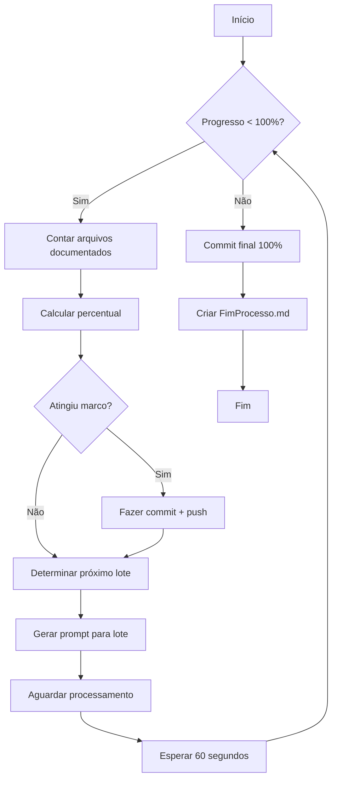

# 🤖 Sistema de Supervisão Automática - Documentação FrotiX

## 📋 Visão Geral

Sistema completo de supervisão automática que gerencia o processo de documentação do FrotiX do início ao fim (0% → 100%).

---

## 🎯 Funcionalidades

✅ **Monitoramento Contínuo**
- Verifica progresso a cada 60 segundos
- Conta arquivos documentados automaticamente
- Calcula percentual em tempo real

✅ **Gestão de Agentes**
- Lança novos agentes automaticamente
- Processa em lotes de 10 arquivos
- Determina próximos arquivos pendentes

✅ **Commits Automáticos**
- Commits nos marcos: 15%, 20%, 25%, 30%, 35%, 40%, 45%, 50%, 55%, 60%, 65%, 70%, 75%, 80%, 85%, 90%, 95%, 100%
- Push automático para GitHub
- Mensagens de commit padronizadas

✅ **Notificação de Conclusão**
- Cria arquivo `FimProcesso-<timestamp>.md` ao atingir 100%
- Relatório completo com estatísticas
- Histórico de commits incluído

---

## 📂 Arquivos Criados

| Arquivo | Descrição | Uso |
|---------|-----------|-----|
| `supervisor-documentacao.sh` | Script Bash básico | Monitoramento manual |
| `supervisor-inteligente.py` | Script Python avançado | Supervisão inteligente |
| `monitor-progresso.ps1` | Script PowerShell | Visualização de progresso |
| `README-Supervisao.md` | Este arquivo | Documentação do sistema |

---

## 🚀 Como Usar

### Opção 1: Supervisor Python (Recomendado)

```bash
cd "/mnt/d/FrotiX/Solucao FrotiX 2026"
python3 supervisor-inteligente.py
```

**Características:**
- ✅ Monitora progresso automaticamente
- ✅ Gera prompts específicos para cada lote
- ✅ Faz commits nos marcos
- ✅ Cria arquivo FimProcesso ao finalizar
- ✅ Interface colorida e informativa

### Opção 2: Supervisor Bash

```bash
cd "/mnt/d/FrotiX/Solucao FrotiX 2026"
bash supervisor-documentacao.sh
```

**Características:**
- ✅ Mais leve que o Python
- ✅ Funciona em qualquer sistema Unix
- ✅ Mesmas funcionalidades básicas

### Opção 3: Monitor PowerShell (Apenas Visualização)

```powershell
cd "D:\FrotiX\Solucao FrotiX 2026"
.\monitor-progresso.ps1
```

**Características:**
- ✅ Apenas monitora (não gerencia)
- ✅ Atualiza a cada 10 segundos
- ✅ Interface tabular com marcos
- ✅ Ideal para acompanhar em paralelo

---

## 📊 Fluxo de Trabalho



---

## 🎯 Marcos de Commit

O sistema faz commits automáticos nos seguintes marcos:

| Marco | Arquivos | Status |
|-------|----------|--------|
| 10% | 92 | ✅ Concluído |
| 15% | 138 | ⏳ Próximo |
| 20% | 185 | ⚪ Pendente |
| 25% | 231 | ⚪ Pendente |
| 30% | 277 | ⚪ Pendente |
| 35% | 323 | ⚪ Pendente |
| 40% | 370 | ⚪ Pendente |
| 45% | 416 | ⚪ Pendente |
| 50% | 462 | ⚪ Pendente |
| 55% | 508 | ⚪ Pendente |
| 60% | 554 | ⚪ Pendente |
| 65% | 601 | ⚪ Pendente |
| 70% | 647 | ⚪ Pendente |
| 75% | 693 | ⚪ Pendente |
| 80% | 739 | ⚪ Pendente |
| 85% | 785 | ⚪ Pendente |
| 90% | 832 | ⚪ Pendente |
| 95% | 878 | ⚪ Pendente |
| 100% | 924 | ⚪ Pendente |

---

## 📝 Formato do Arquivo FimProcesso

Quando o sistema atinge 100%, cria automaticamente:

**Nome**: `FimProcesso-YYYYMMDD_HHMMSS.md`

**Conteúdo**:
- 🎉 Mensagem de conclusão
- 📊 Estatísticas finais (arquivos, cards, try-catch, comentários)
- ✅ Padrões aplicados
- 📂 Diretórios documentados
- 🎯 Histórico de commits
- 📝 Link para DocumentacaoIntracodigo.md

---

## 🔧 Personalização

### Alterar tamanho do lote

**Python** (`supervisor-inteligente.py`):
```python
TAMANHO_LOTE = 10  # Alterar para 5, 15, 20, etc.
```

**Bash** (`supervisor-documentacao.sh`):
```bash
TAMANHO_LOTE=10  # Alterar para 5, 15, 20, etc.
```

### Alterar intervalo de verificação

**Python**:
```python
time.sleep(60)  # Alterar para 30, 120, etc.
```

**Bash**:
```bash
INTERVALO_VERIFICACAO=60  # Alterar para 30, 120, etc.
```

### Alterar marcos de commit

**Python**:
```python
MILESTONES = [15, 20, 25, 50, 75, 100]  # Personalizar lista
```

**Bash**:
```bash
marcos=(15 20 25 50 75 100)  # Personalizar array
```

---

## 🐛 Troubleshooting

### Problema: Script Python não encontra módulos

```bash
# Instalar Python 3 (se necessário)
sudo apt update && sudo apt install python3

# Verificar versão
python3 --version
```

### Problema: Permissão negada no bash

```bash
# Executar com bash explicitamente
bash supervisor-documentacao.sh

# Ou tornar executável (pode não funcionar em WSL)
chmod +x supervisor-documentacao.sh
./supervisor-documentacao.sh
```

### Problema: Git push falha

```bash
# Verificar credenciais
git config --global credential.helper

# Reconfigurar se necessário
git config --global credential.helper cache
```

### Problema: Arquivo FimProcesso não é criado

**Causa**: Sistema ainda não atingiu 100%

**Solução**: Aguardar processo completo ou verificar contagem em `DocumentacaoIntracodigo.md`

---

## 📈 Monitoramento em Tempo Real

### Ver progresso atual (rápido)

```bash
grep -c "^\- \[x\]" FrotiX.Site/DocumentacaoIntraCodigo/DocumentacaoIntracodigo.md
```

### Ver percentual atual (com cálculo)

```bash
echo "scale=2; ($(grep -c "^\- \[x\]" FrotiX.Site/DocumentacaoIntraCodigo/DocumentacaoIntracodigo.md) * 100) / 924" | bc
```

### Ver último commit

```bash
git log --oneline --grep="docs: documentação FrotiX" | head -1
```

### Ver todos os marcos atingidos

```bash
git log --oneline --grep="Marco" | grep "docs: documentação FrotiX"
```

---

## 🎨 Output do Supervisor

### Cores no Terminal

- 🔴 **Vermelho**: Erros críticos
- 🟢 **Verde**: Sucesso (commits, marcos atingidos)
- 🟡 **Amarelo**: Avisos (push falhou, aguardando)
- 🔵 **Azul**: Informações gerais
- 🟣 **Magenta**: Iterações
- 🔷 **Ciano**: Títulos e separadores

### Exemplo de Output

```
═══════════════════════════════════════════════════════════════
  🚀 SUPERVISOR INTELIGENTE - DOCUMENTAÇÃO FROTIX
═══════════════════════════════════════════════════════════════

──────────────────────────────────────────────────────────────
Iteração #1 - 14:30:15
──────────────────────────────────────────────────────────────

═══════════════════════════════════════════════════════════════
  📊 ESTATÍSTICAS DE PROGRESSO
═══════════════════════════════════════════════════════════════
  Arquivos documentados: 100/924
  Progresso atual: 10.82%
  Próximo marco: 15%
  Faltam para próximo marco: 38 arquivos
═══════════════════════════════════════════════════════════════

📋 Próximo lote (10 arquivos):
  1. PatrimonioController.cs
  2. PdfViewerCNHController.cs
  3. PdfViewerController.cs
  ...

⏳ Aguarde o agente processar este lote...
   Verificando novamente em 60 segundos...
```

---

## 📚 Referências

- **DocumentacaoIntracodigo.md**: Log central com todos os arquivos documentados
- **RegrasDesenvolvimentoFrotiX.md**: Padrões de documentação aplicados
- **Git History**: Histórico completo de commits no repositório

---

## ✅ Status Atual

**Progresso**: 100/924 arquivos (10.82%)
**Último Marco**: 10% (commit 3995bab)
**Próximo Marco**: 15% (138 arquivos)
**Status**: 🟢 Sistema pronto para uso

---

## 🤝 Suporte

Em caso de dúvidas ou problemas:

1. Verificar logs no terminal
2. Consultar seção Troubleshooting
3. Verificar DocumentacaoIntracodigo.md manualmente
4. Verificar git status para mudanças pendentes

---

**Criado por**: Claude Sonnet 4.5
**Data**: 2026-01-26
**Versão**: 1.0
**Status**: ✅ Pronto para produção
